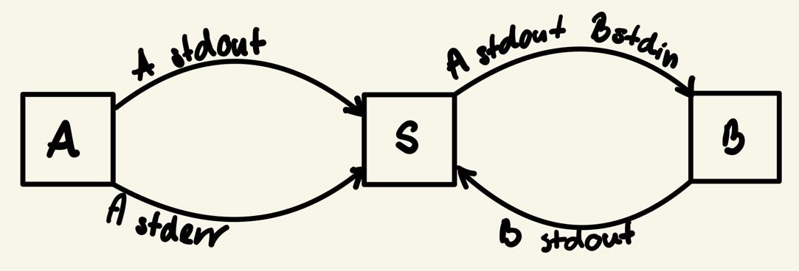
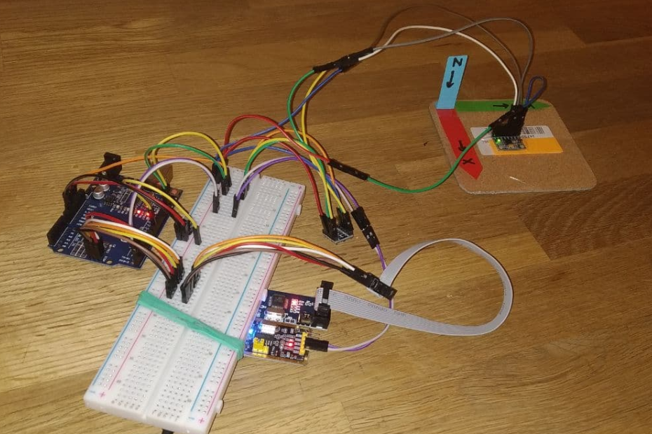
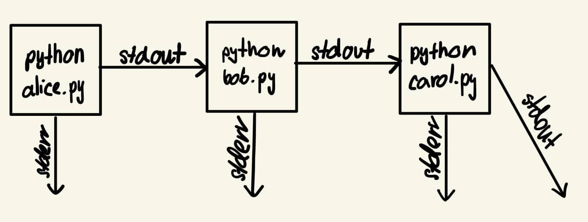

# Go stuff

Random stuff written in Go.

## Content

- **subprocesses** - playing with two child processes and redirecting their standard streams to each other.

    

- **serial** - reading and writing bytes sent via serial port.

    **Example output:**
    ```
    2021/06/15 13:20:28 Wrote 3 bytes: [100 115 100]
    2021/06/15 13:20:28 Recieved: [189 35 162 76 68 12 43 252 178 24]
    ```

- **serial-read-accel** - reading accelerometer and gyroscope data frames sent via serial port.

    It is part of a project which takes advantage of [MPU6050](https://invensense.tdk.com/products/motion-tracking/6-axis/mpu-6050/) accelerometer connected to [Atmega328P](https://www.microchip.com/wwwproducts/en/ATmega328P). Atmega collects MPU data, and transmits it via serial port. Each accelerometer and gyroscope measurement is packed into a frame which starts from 4 bytes `76 68 12 43` and ends with `35 X`, where `X` is a 1-byte CRC checksum (however it is not checked in this program).

    **Example output:**
    ```
    ...
    [76 68 12 43 252 102 24 194 52 38 255 227 0 27 255 194 35 100]
    OK -1766  6416 14892     215  -201    99   0
    [76 68 12 43 252 202 24 206 52 64 255 225 0 28 255 196 35 161]
    OK -1666  6428 14918     213  -200   101   16668900
    [76 68 12 43 252 152 25 2 52 18 255 225 0 28 255 195 35 107]
    OK -1716  6480 14872     213  -200   100   0
    ...
    ```
    Odd lines represent raw data frame. Even lines represent processed data: accelerometer (X, Y, Z), gyroscope (X, Y, Z), and time difference between two measurements.
    
    
    
    Real-time accelerometer and gyroscope data can be visualised with this [Python script](https://github.com/dsonyy/python-stuff/tree/master/accelerometer-live-plot):
    
    **[YouTube video](https://www.youtube.com/watch?v=J4pH3LHojVM)**
    
    
    
    **Usage:**
    ```
    $ go run serial-read-accel.go | python accel-plot.py
    ```
    
    
    
- **pipeline** - simple cross-platform emulation of well-known Unix-like pipelines in Go. 
  
    It was inspired by the fact that Windows 'pipelines' behaviour in different way. They buffer entire output of the first program, and when its execution is finished, send it to the next one. In case where data stream of the first program is continuous and never ends, another approach is required. This program may solve this issue because it immediately passes characters to the next process.
    **Example usage:**
    
    ```
    > go run .\pipeline.go python .\programs\alice.py -> python .\programs\bob.py -> python .\programs\carol.py
    ```
    Note that `->` is used because `|` is reserved.
    
    
